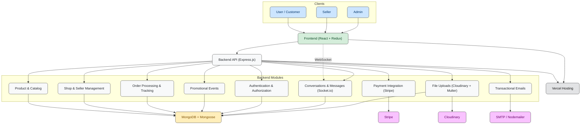
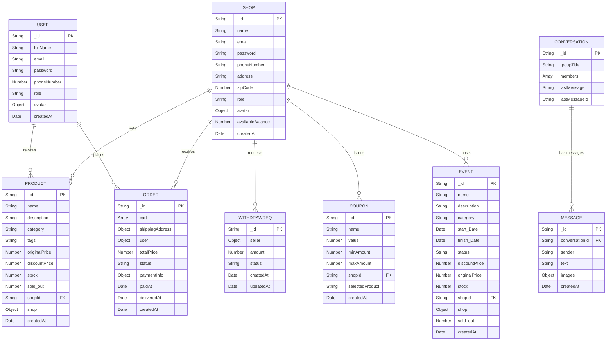
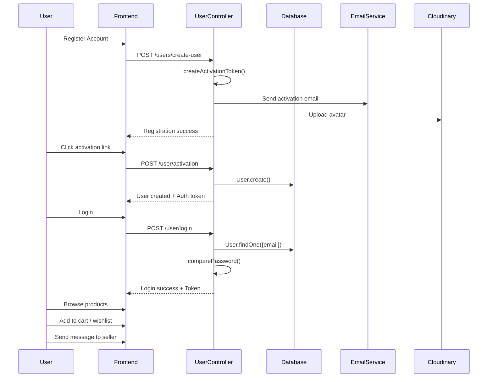
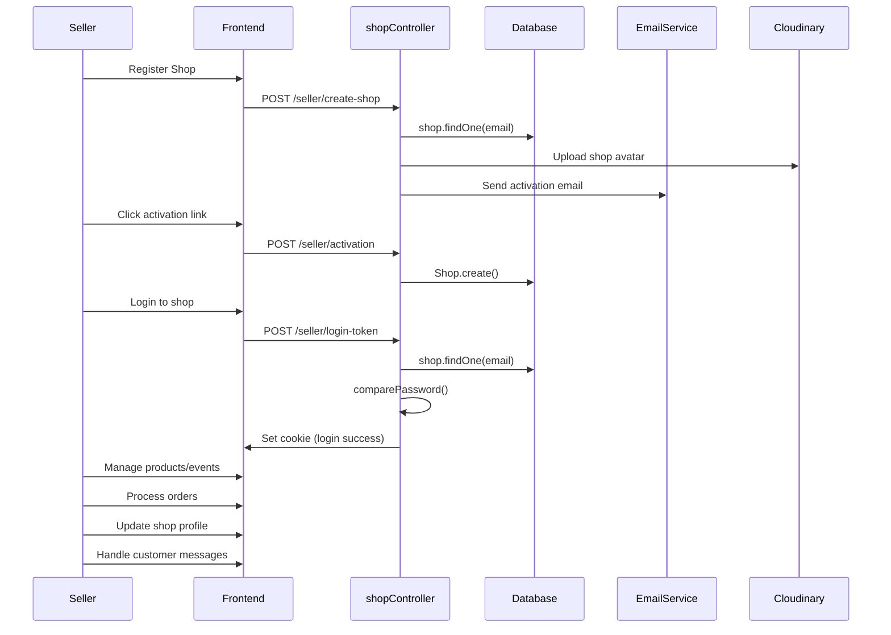
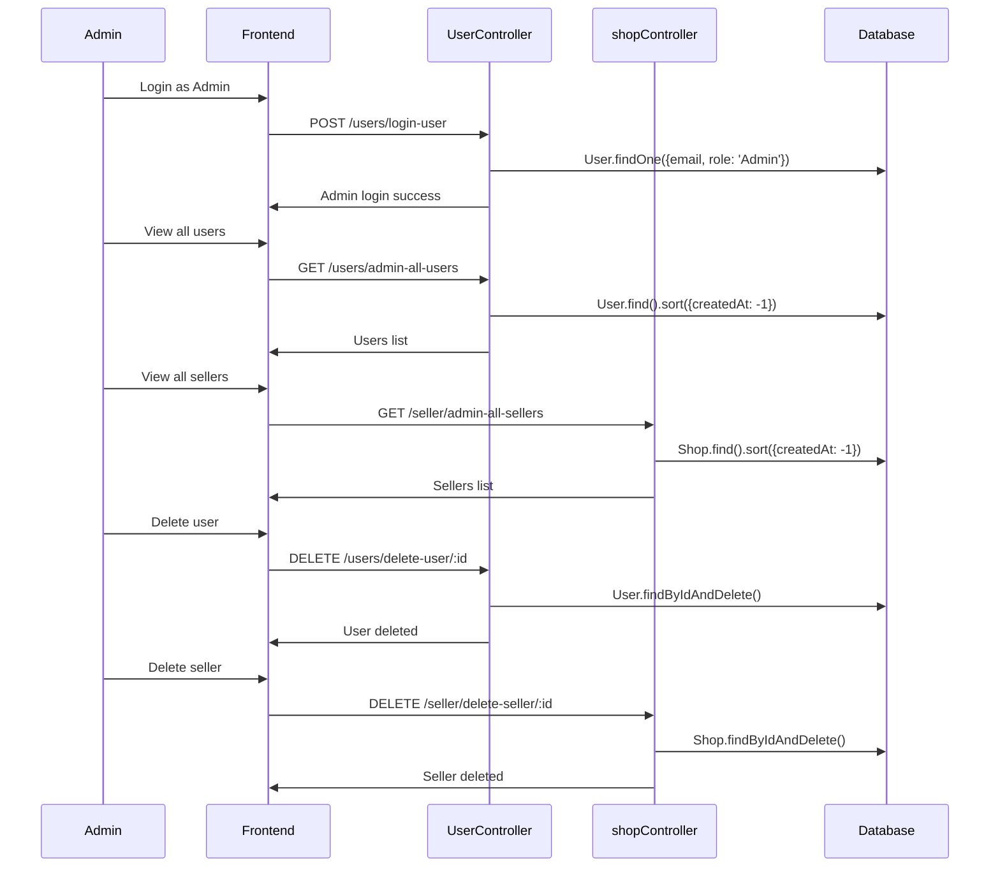

# Complete Case Study - Multi-Vendor E-commerce Platform

## Overview

The **Multi-Vendor E-commerce Platform** is a comprehensive marketplace solution designed to connect customers, sellers, and administrators in a seamless ecosystem.

o- **Customers** can browse products, participate in promotional events, place orders, and communicate directly with sellers. 

o- **Sellers** can create shops, manage product catalogs, process orders, and engage with customers.  

o- **Administrators** oversee platform operations, manage users, and monitor system health.  

The platform integrates **real-time communication**, **secure payment processing**, and **automated email notifications** to deliver a complete e-commerce experience. 

---

## Goals of the Project

The **Multi-Vendor E-commerce Platform** is designed to provide a complete, scalable, and engaging online marketplace that empowers both sellers and customers.

o- **Multi-vendor marketplace functionality** – Multiple independent sellers can create and manage their own shops with dedicated seller interfaces for shop management, product listings, and order processing.  

o- **Complete e-commerce experience** – Customers can browse products, add items to cart or wishlist, process payments through **Stripe**, and track their orders throughout the fulfillment cycle.  

o- **Real-time communication** – Integrated chat functionality enables direct messaging between buyers and sellers, facilitating product inquiries and customer support.  

---

## System Architecture Overview

The platform is built using a modern **full-stack JavaScript architecture** with the following core technologies:

| **Layer**        | **Technology**                 | **Purpose**                                  |
|------------------|--------------------------------|----------------------------------------------|
| Frontend         | React 18 + Vite                | User interface and build tooling             |
| State Management | Redux Toolkit                  | Global application state                     |
| Backend          | Express.js 5.1.0               | REST API server                              |
| Database         | MongoDB + Mongoose 8.17.1      | Document storage and ODM                     |
| Real-time        | Socket.io                      | Live messaging functionality                 |
| Authentication   | JWT + bcrypt                   | Token-based authentication with password hashing |
| Payments         | Stripe 18.5.0                  | Payment processing                           |
| File Storage     | Cloudinary + Multer            | Image upload and storage                     |
| Email            | Nodemailer 7.0.5               | Transactional emails                         |
| Deployment       | Vercel                         | Production hosting                           |

---

## System Architecture Diagram

---

## Key Features

The **Multi-Vendor E-commerce Platform** offers comprehensive functionality across three main user interfaces: **customer shopping**, **seller management**, and **admin oversight**.

### Multi-Role User System
The platform supports three distinct user roles with dedicated interfaces and protected routing:
- **Customer Interface**: Shopping, cart management, order tracking, and messaging  
- **Seller Dashboard**: Product management, order processing, and shop analytics  
- **Admin Panel**: User management, order oversight, and platform administration  

### Product Management & Shopping
Comprehensive product catalog functionality with search and categorization:
- **Product Search**: Real-time search with dropdown results  
- **Category Navigation**: Grid-based category browsing with visual icons  
- **Shopping Cart**: Add to cart functionality with stock validation  
- **Wishlist Management**: Save and remove products from wishlist  

### Payment Processing
- Secure payment integration through **Stripe Elements** with conditional rendering based on API key availability  

### Real-Time Messaging
- Built-in messaging system for **customer-seller communication**  
- Supports **images** and **real-time updates**  

### Seller Dashboard Features
Powerful tools for sellers to manage their shops:
- **Account Balance Tracking**: Revenue monitoring with service charge calculations  
- **Order Management**: View and process all shop orders  
- **Product Analytics**: Track total products and performance metrics  
- **Coupon Management**: Create and manage discount codes  

### API Architecture
Organized **RESTful API** with endpoints for different business domains:
- User authentication and profiles: `/api/v2/user/*`  
- Shop and seller management: `/api/v2/seller/*`  
- Product catalog operations: `/api/v2/product/*`  
- Order processing: `/api/v2/order/*`  
- Payment integration: `/api/v2/payment/*`  
- Messaging system: `/api/v2/conversation/*`, `/api/v2/messages/*`  

### Brand Value Propositions
The platform emphasizes customer-focused benefits:
- Free shipping on orders over $100  
- Daily surprise offers with up to 25% savings  
- Factory-direct affordable pricing  
- 100% secure payment protection  

--- 

## Tech Stack

**Backend:**  

**Node.js** – JavaScript runtime for building fast and scalable server-side apps  
**Express.js** – Minimal and flexible Node.js web framework  
**MongoDB** – NoSQL database for flexible and scalable data storage  
**Mongoose** – Elegant MongoDB object modeling for Node.js  
**JWT** – Secure user authentication and authorization  
**bcrypt** – Password hashing for secure authentication  
**Nodemailer** – Email handling and notifications  
**Stripe** – Payment gateway integration  

**Frontend:**  

**React** – Library for building interactive user interfaces  
**Vite** – Lightning-fast frontend build tool and dev server  
**Redux Toolkit** – Efficient state management for React apps  

**File & Media Handling:**  

**Multer** – Middleware for handling file uploads  
**Cloudinary** – Cloud-based media management and storage  

**Real-time Communication:**  

**Socket.io** – Real-time bi-directional communication for chat & notifications  

**Development & Deployment Tools:**  

**Nodemon** – Automatically restarts server on file changes  
**dotenv** – Environment variable management  
**Vercel** – Easy deployment and hosting platform  

--- 

## Challenges & Solutions

| Challenge | Solution |
|-----------|---------|
| **Sign-up token expired for users and sellers** | Resolved by adjusting React Strict Mode settings, which prevented token re-render issues and ensured consistent authentication. |
| **Modeling errors in database schema** | Carefully reviewed and corrected Mongoose schemas and relationships to match backend logic, ensuring proper data validation and storage. |
| **Redux state management issues (data not coming)** | Implemented proper async actions and state slices in Redux Toolkit, ensuring smooth data flow between backend and UI components. |
| **Stripe payment integration issues** | Used Stripe’s sandbox/testing environment to debug and validate payment flows before moving to production. |
| **Image uploading challenges** | Initially used local folder uploads, then transitioned to Cloudinary for scalable and cloud-based image storage and management. |
| **Production errors with Vercel & Node.js** | Adjusted deployment configurations, ensured environment variables were correctly set, and managed server reload issues for smooth production builds. |
| **LocalStorage management** | Implemented proper get/set logic with JSON parsing to store and retrieve user sessions and app state reliably. |
| **Data fetching from backend and displaying in UI** | Set up proper API calls with error handling and used React hooks (useEffect, useState) to render data accurately on the frontend. |
| **Middleware configuration issues** | Correctly configured Express middlewares for authentication, error handling, and data parsing, ensuring secure and smooth request processing. |

---

## Database Design

---

## Application Flow Diagram

```mermaid
flowchart TB
    %% Frontend Layer
    subgraph FrontendLayer["Frontend Layer"]
        subgraph UserInterface["User Interface"]
            CustomerUI["Customer Interface<br/>- Product Discovery<br/>- Cart Management<br/>- Checkout Process"]
            SellerUI["Seller Dashboard<br/>- Product Management<br/>- Order Processing<br/>- Messaging"]
            AdminUI["Admin Panel<br/>- User Management<br/>- System Oversight"]
        end
        
        subgraph ReactComponents["React Components"]
            ProductDetails["ProductDetails Component"]
            UserInbox["UserInbox Component"]
            DashboardMessages["DashboardMessages Component"]
        end
        
        subgraph StateManagement["State Management"]
            ReduxStore["Redux Store<br/>- User State<br/>- Product State<br/>- Cart/Wishlist"]
        end
    end
    
    %% Communication Layer
    subgraph CommunicationLayer["Communication Layer"]
        HTTPREST["HTTP/REST"]
        CORS["CORS Middleware<br/>Credentials: true"]
        Auth["JWT Cookie Authentication"]
        SocketIO["Socket.io WebSocket<br/>socket-server-89h0.onrender.com"]
    end
    
    %% Backend Layer
    subgraph BackendLayer["Backend Layer"]
        ExpressServer["Express.js Server<br/>API Gateway Port 5000"]
        subgraph RouteModules["Route Modules"]
            UserRoutes["/api/v2/user/*<br/>Authentication & Profiles"]
            SellerRoutes["/api/v2/seller/*<br/>Shop Management"]
            ProductRoutes["/api/v2/product/*<br/>Catalog Operations"]
            OrderRoutes["/api/v2/order/*<br/>Order Processing"]
            ConversationRoutes["/api/v2/conversation/*<br/>Chat Management"]
            MessageRoutes["/api/v2/messages/*<br/>Message Operations"]
            PaymentRoutes["/api/v2/payment/*<br/>Stripe Integration"]
            CouponRoutes["/api/v2/coupons/*<br/>Coupons"]
            EventRoutes["/api/v2/events/*<br/>Events"]
            WithdrawRoutes["/api/v2/withdraw-request/*<br/>Withdraw Requests"]
        end
    end
    
    %% Data Layer
    subgraph DataLayer["Data Layer"]
        MongoDB["MongoDB Database<br/>Document Storage"]
        Cloudinary["Cloudinary<br/>Image Storage"]
        Stripe["Stripe API<br/>Payment Processing"]
    end
    
    %% Connections: Frontend -> Communication
    CustomerUI --> CORS
    SellerUI --> CORS
    AdminUI --> CORS
    
    ProductDetails --> ReduxStore
    UserInbox --> SocketIO
    DashboardMessages --> SocketIO
    
    %% Connections: Communication -> Backend
    CORS --> Auth
    Auth --> ExpressServer
    SocketIO -.-> MessageRoutes
    
    %% Connections: Backend -> Routes
    ExpressServer --> UserRoutes
    ExpressServer --> SellerRoutes
    ExpressServer --> ProductRoutes
    ExpressServer --> OrderRoutes
    ExpressServer --> ConversationRoutes
    ExpressServer --> MessageRoutes
    ExpressServer --> PaymentRoutes
    ExpressServer --> CouponRoutes
    ExpressServer --> EventRoutes
    ExpressServer --> WithdrawRoutes
    
    %% Connections: Backend -> Data
    UserRoutes --> MongoDB
    SellerRoutes --> MongoDB
    ProductRoutes --> MongoDB
    OrderRoutes --> MongoDB
    ConversationRoutes --> MongoDB
    MessageRoutes --> MongoDB
    MessageRoutes --> Cloudinary
    PaymentRoutes --> Stripe
    CouponRoutes --> MongoDB
    EventRoutes --> MongoDB
    WithdrawRoutes --> MongoDB
    
    %% Real-time Flow
    UserInbox -.->|"Real-time Messages"| DashboardMessages

```

---

## User Flow

---
## Seller Flow

---

## Admin Flow

---

## Best Practices

### Authentication & Security
- Secure authentication with **JWT tokens stored in HTTP-only cookies** (prevents XSS attacks).  
- **Password hashing with bcrypt** to protect user credentials.  
- **Sensitive fields (like passwords)** excluded from queries by default.  
- **Role-based authorization** ensures admin-only operations are properly restricted.  

### Component Architecture
- **Separation of concerns** with modular React components for maintainability.  
- **Clean state management** for predictable behavior across Customer, Seller, and Admin flows.  
- **Protected routes** to enforce proper access control for different user roles.  

### Error Handling & User Experience
- **Graceful error handling** for cart and product operations.  
- **Stock validation** prevents adding unavailable products.  
- **Toast notifications** provide immediate user feedback for actions.  
- **Duplicate prevention** in cart ensures smoother shopping experience.  

---

## Conclusion

The Multi-Vendor E-commerce Platform stands out as a complete, scalable, and production-ready solution.  
It combines **technical excellence**, **feature richness**, and **business value** by uniting customers, sellers, and administrators in one ecosystem.  
With secure authentication, modular architecture, and enterprise-level deployment practices, the platform is well-prepared for real-world use and future growth.  

